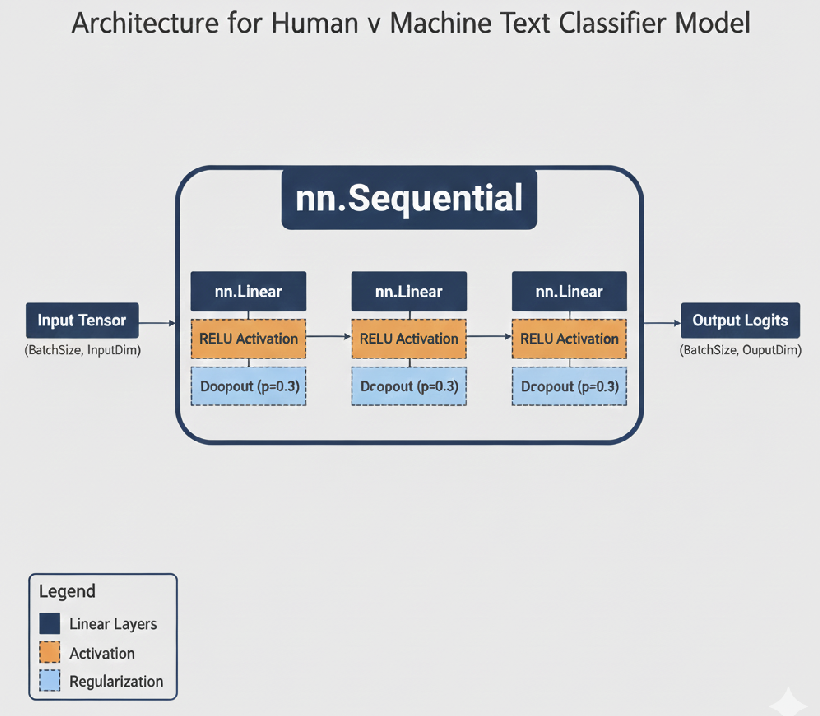

# Human V Machine Language Classifier
## EN 705.641 NLP Final Project
### Jose Montalvo Ferreiro, Muhammad Khan, Joe Mfonfu, Madihah Shaik

[Presentation Slides](https://docs.google.com/presentation/d/1B-RdgZzLafXHr7mEVduqDNgqa0cGlSDPfSTU-bc7OqM/edit?usp=sharing)

## About Project
In this project, we trained a feedforward neural network to distinguish between human-written and machine-genrated text by using a hybrid approach that integrated semantic and stylic features of the input text. This approach is similar to the techniques discussed in [\[1\]](https://openreview.net/pdf?id=cWiEN1plhJ) and [\[2\]](https://arxiv.org/pdf/2505.14608). The semantic features are gotten from embeddings generated using a [BERT-base-uncased](https://huggingface.co/google-bert/bert-base-uncased) model that we further finetuned for the task of human-machine text classification using the [Human Vs. LLM Text Corpus](https://www.kaggle.com/datasets/starblasters8/human-vs-llm-text-corpus?resource=download) dataset. The style features were extracted as embeddings in our data preprocessing notebook using the [StyleDistance](https://huggingface.co/StyleDistance/styledistance) model that was trained to separate semantics from style for applications like authorship detection. After concatenating the embeddings from the finetuned BERT model and those from StyleDistance, we used this as input for training a zero-shot 3-layer feed-forward neural network (or muli-layer perceptron) that can delienate human and machine text with a >96% accuracy.

## Architecture Diagram



## Project Folder Layout
```
.
├── baseline_model.ipynb
├── data
│   ├── human_v_machine_bert_finetuned
│   ├── human_v_machine_data
│   ├── human_v_machine_data_processed
│   └── human_v_machine_models
├── model_architecture.png
├── nlp_final_proj_data_prep.ipynb
├── nlp_final_proj_model_training.ipynb
├── README.md
├── requirements.txt
├── test_app.py
├── test_data_1000_sampled.csv
├── test_data_100_sampled.csv
└── transformer_model.ipynb

```

## Instructions to Run Code and Test the Model

1. Create and acivate conda environment.

   ```bash
   conda create --name human_v_machine_class python=3.12 jupyter
   conda activate human_v_machine_class
   ```
   
2. Install requirements.

   ```bash
   pip install -r requirements.txt
   ```
   
3. To run project notebooks and replicate our process, launch jupyter notebooks and open the individual notebook files. Get the original data from [Human Vs. LLM Text Corpus](https://www.kaggle.com/datasets/starblasters8/human-vs-llm-text-corpus?resource=download) and put in the `./data/human_v_machine_data` folder.

   ```bash
   jupyter notebook
   ```

4. To run the test application on a local machine. You may use the sample files in `./data/human_v_machine_data_processed` as input for testing.

   ```bash
   streamlit run test_app.py
   ```
   
5. To access the cloud-hosted version of the test app for convenience, visit [TestApp](https://joekmfonfu-hvm-test-app-app-qtwkai.streamlit.app/).The `./test_data_100_sampled.csv` or `./test_data_1000_sampled.csv` sample files can be used for testing.


# Testing Demonstration


